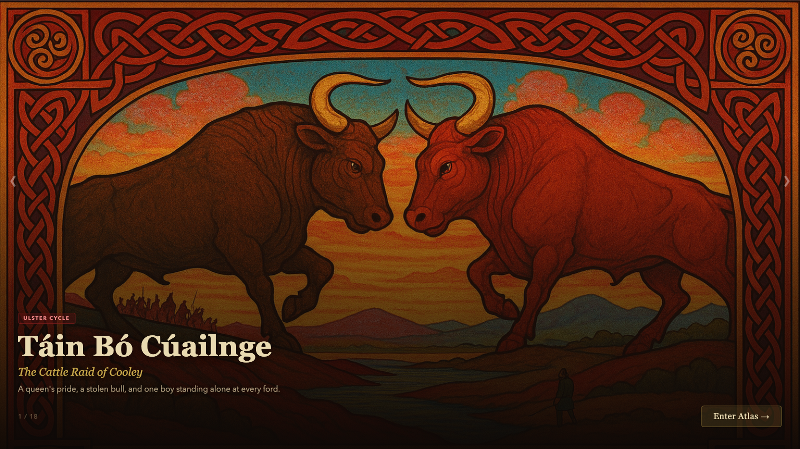
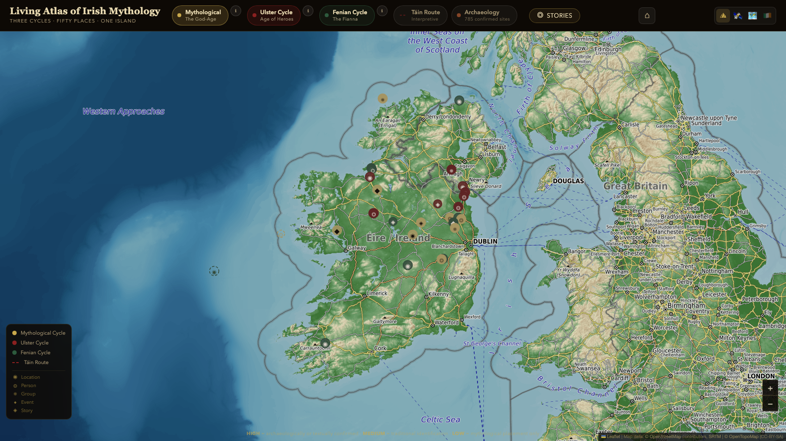
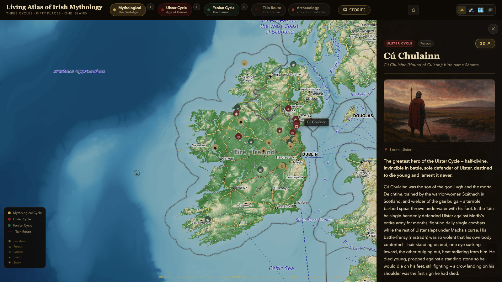

<p align="center">
  
</p>

<h1 align="center">The Celtic Realm</h1>
<p align="center"><i>A Living Atlas of Irish Mythology</i></p>

<p align="center">
  
  
  
</p>



## Elevator pitch

An interactive, sourced atlas of Ireland's three great mythology cycles — 50 researched entries, 785 archaeological sites, 78 characters, and 101 stories, mapped across the real island, each tagged with a confidence rating on how well-attested it actually is. Enter a location and you can drop into a small animated 3D diorama of the place, staged with a hand-tuned cinematic camera.

## Why I built it

<!-- DRAFT — replace with your own voice before publishing. Most online "Irish mythology map" content is either a single Wikipedia-sourced blog post or a tourist map with no scholarly grounding. This started as a way to combine three things: real primary-source research (Lebor Gabála Érenn, Cath Maige Tuired, the Táin), an interactive map as the organizing metaphor instead of a wall of text, and a small canvas-rendered diorama for the handful of places that deserved more than a pin on a map. -->

## The problem

Existing Irish-mythology resources are either academically dense (hard to explore casually) or casually written (no sourcing, no way to judge how legendary vs. historically-attested a claim is). This atlas keeps a stated lore policy — *"every entry is drawn from recorded Irish tradition; nothing is invented and passed off as old"* — and ties every entry to a named primary source and an explicit confidence rating, while still being something you can just click around for ten minutes.

**Confidence scale, with real examples:**

| Level | Meaning | Examples |
|---|---|---|
| **High** | Archaeologically confirmed or explicitly named in a primary medieval text | Hill of Tara, Emain Macha (Navan Fort), Rathcroghan, Newgrange |
| **Medium** | Traditional identification recorded in medieval/early-modern sources, exact coordinates approximate | Both Battle of Mag Tuired sites, Ford of Ferdia (Ardee) |
| **Low** | Mythological/symbolic — no physical location can be assigned | Tír na nÓg, Manannán mac Lir |

The Táin Route itself is always labelled **"Interpretive"** — the Táin names places but its exact geography is debated, so waypoints are plausible, not authoritative.

## Features

- **Three mythology cycles** — Mythological (18 entries, gold), Ulster (17, crimson), Fenian (15, forest green) — independently toggleable
- **785-site archaeology layer** on top of the curated 50, for real find-locations rather than just narrative ones
- **Táin Route** — the interpretive dotted line described above
- **Story mode** and a **character browser** (78 named figures) layered over the same map
- **Cinematic "3D" flythrough** — hand-tuned camera (altitude / range / tilt / heading) per notable location, not a generic zoom
- Terrain / satellite / classic basemap switching

## Screenshots

| Hero gallery | Map overview | Entry detail |
|---|---|---|
|  |  |  |

## Architecture

Full diagram: [`assets/architecture/architecture.md`](assets/architecture/architecture.md). In short: static, client-only, data-driven. Three curated JSON datasets plus a larger archaeology dataset load at boot into a Leaflet map; selecting an entry opens a detail panel, and select locations offer a "3D" hand-off into a separate canvas-rendered diorama with procedural creature behaviour (mood driven by trait weights — calm / curiosity / mischief / sociability — not fixed animation).

## Technology stack

- **Vite** — build tooling, dev server
- **Leaflet** — the interactive map
- **Vanilla JS (ES modules)** — no framework; `atlas/` (map + UI), `world/` (canvas diorama), `state/` (store), `story/` (narrative playback)
- **Canvas 2D / WebGL** — the diorama's background, atmosphere, and creature rendering
- Data authored directly as JSON — no CMS, no database

## Quick start

```bash
npm install
npm run dev
```

Opens on `localhost:3010` (or the port in `.claude/launch.json`). `npm run build` produces a static `dist/` — no server-side component, deploys anywhere that serves static files.

## Data model

Each entry lives in `src/data/{mythological,ulster,fenian}.json`:

```jsonc
{
  "id": "tara",               // kebab-case unique ID
  "name": "Hill of Tara",
  "nameIrish": "Teamhair na Rí",
  "layer": "mythological",    // "mythological" | "ulster" | "fenian"
  "type": "location",         // location | person | deity | group | story | event | artifact | creature
  "lat": 53.5794, "lng": -6.6148,
  "county": "Meath", "province": "Leinster",
  "shortSummary": "...",
  "explanation": "...",
  "sources": ["Lebor Gabála Érenn", "Cath Maige Tuired"],
  "confidence": "high"        // "high" | "medium" | "low"
}
```

See [`ADDING.md`](ADDING.md) for the full guide to adding a new entry or an entirely new cycle layer, plus artwork format requirements (`.webp`, 16:9, 800×450 minimum).

## Lessons learned

- Splitting the app into a 2D map layer (`atlas/`) and a separate canvas "world" layer (`world/`) kept the map fast — the diorama only initializes when a visitor actually opens it.
- Hand-tuning camera parameters per location (`flythrough.js`) reads as deliberate direction rather than a generic "fly to marker" effect — worth the extra authoring time for the highest-value locations.
- Committing to a `confidence` field on every entry from day one made it much easier to stay honest about folklore vs. archaeologically-attested claims, instead of retrofitting caveats later.
- An earlier prototype ("The Otherworld Hearth" — an animated creature diorama, Chapter I of this project) is preserved on the `archive/otherworld-hearth-prototype` branch and tagged `v0.1-otherworld-hearth`, fully recoverable rather than deleted.

## Roadmap / Future direction

- [ ] Deploy to GitHub Pages (static build, no blockers)
- [ ] Artwork pass — illustrations for the remaining placeholder slots
- [ ] Entry search across names, summaries, counties
- [ ] Click-through on `associatedFigures` to jump between related entries
- [ ] Diarmuid & Gráinne route (equivalent to the Táin Route) and an animated Oisín's-return route
- [ ] Cycle-era timeline showing the three cycles relative to each other and to early history

## Current maturity

**Beta.** Core map, three cycles, story mode, character browser, and the cinematic flythrough are all built and working locally. Not yet deployed publicly.

## License

MIT — see [`LICENSE`](LICENSE).
