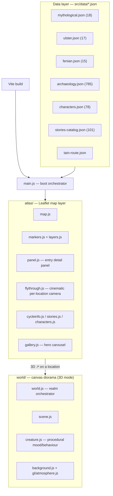

# Architecture

**How it fits together:** three hand-researched JSON datasets (mythological / Ulster / Fenian cycles, 50 entries total) plus a much larger supporting archaeology layer (785 sites) are loaded once at boot and handed to a Leaflet-based map layer. Selecting an entry opens a detail panel; the "3D" affordance on a location hands off to a separate canvas-based "world" renderer that stages a small animated diorama — background, atmosphere, and creatures with a procedural mood system (calm / curiosity / mischief / sociability) rather than fixed animations. A `flythrough.js` module holds hand-tuned cinematic camera parameters (altitude, range, tilt, heading) per named location, so each "fly to" transition is directed rather than a generic zoom.

No backend — the entire app is static, client-rendered, and data-driven from committed JSON.
